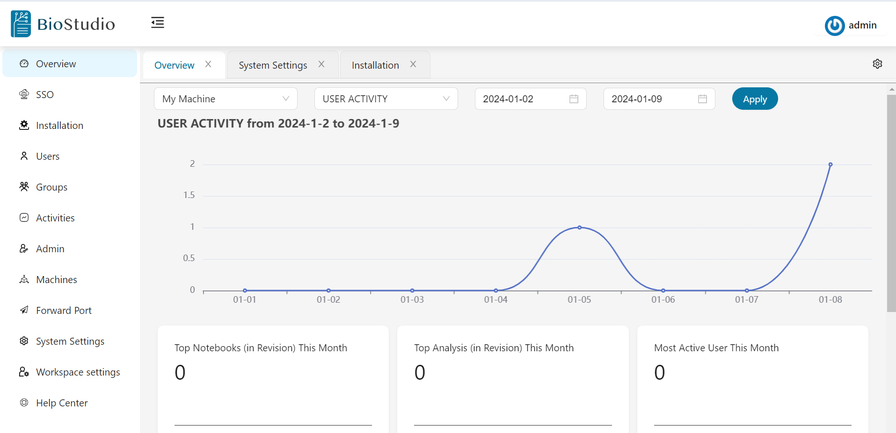
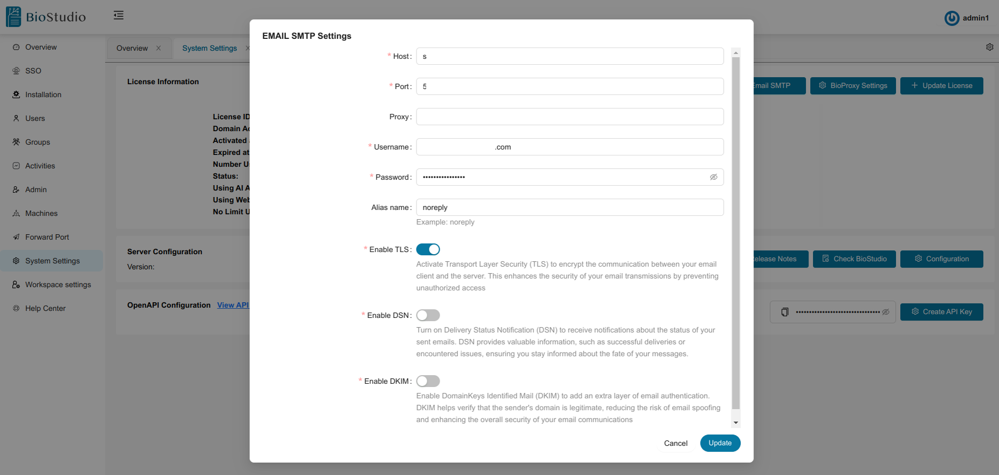

# 
  BioStudio Email - SMTP   

## Introduction

BioStudio workspace and other application has a feature that require email notification. If you wish to get email notification. Kindly configure SMTP.

Here are the steps to setup it.

:diamond_shape_with_a_dot_inside: Login to **BioStudio Admin Dashboard**.

  

:diamond_shape_with_a_dot_inside: Click to **System Setting**.
:diamond_shape_with_a_dot_inside: Click to **Email SMTP**.
:diamond_shape_with_a_dot_inside: Kindly configure SMTP setup by filling mandatory values.

  

:diamond_shape_with_a_dot_inside: Click on Update button. 

:bell: **Note**: This is global configuration.

For more information, please contact us at support@bioturing.com.