# 
  Cell-Cell communication   

## Introduction

**Cell-Cell communication**

  <b> CellChat </b> is now applicable to spatial imaging data. We showcase its application to 10X Visium data. When spatial locations of spots/cells are available, CellChat infers spatial-informed cell-cell communication between interacting cell groups. CellChat restricts cell-cell communication within the maximum interaction/diffusion length of molecules.

Here are the steps to install it.

:diamond_shape_with_a_dot_inside: Login to **BioStudio Admin Dashboard**.
   

:diamond_shape_with_a_dot_inside: Click to **Installation** menu.
 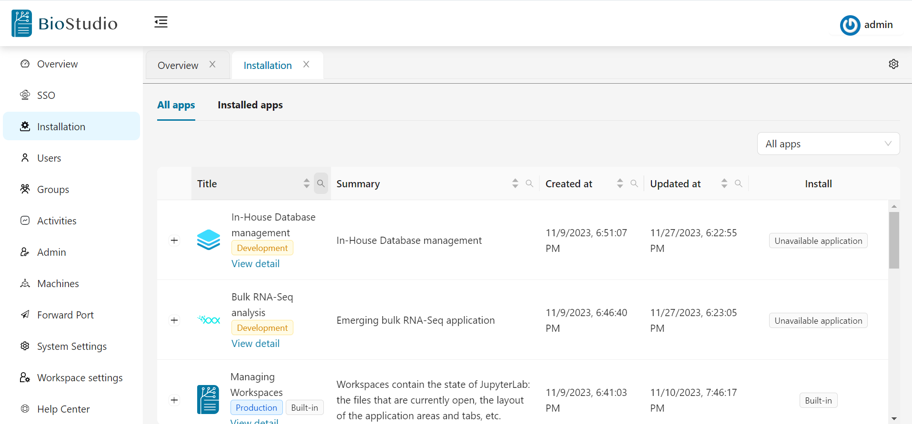  

:diamond_shape_with_a_dot_inside: Search **Cell-Cell** application.
 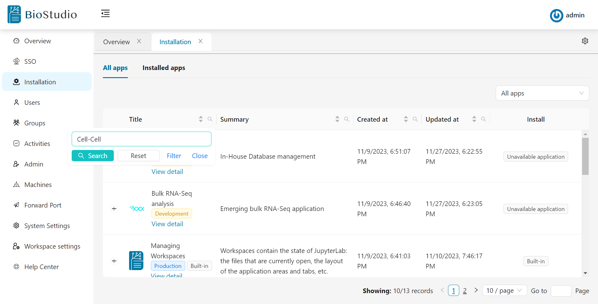  

:diamond_shape_with_a_dot_inside: Click to **Install app** button.
 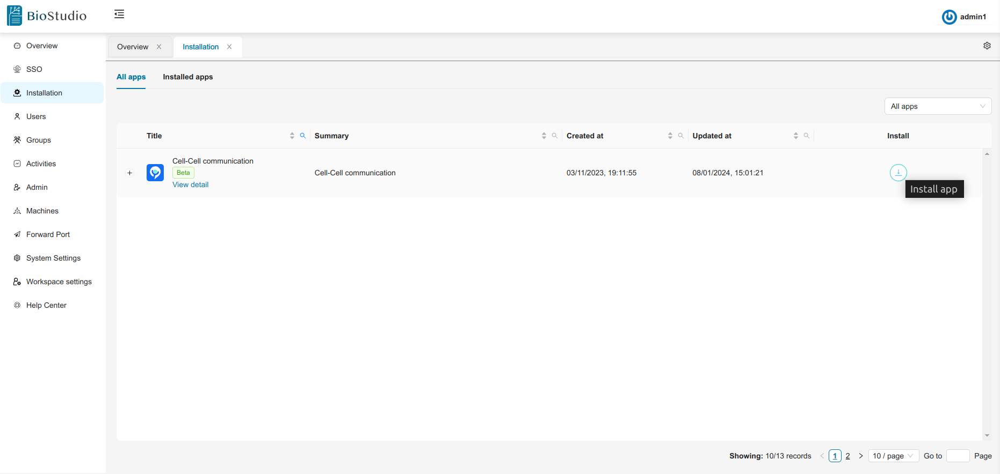  

:diamond_shape_with_a_dot_inside: Select **version** and **machine ID**.
:diamond_shape_with_a_dot_inside: Click to **Submit**.
 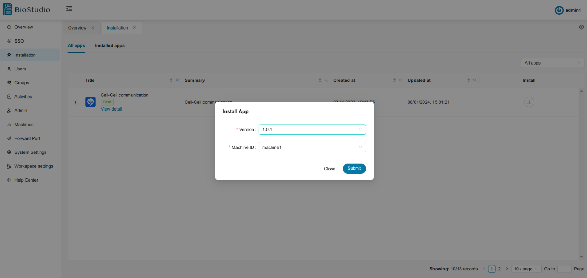  

:bell: **Note**: Cellchat application installation will takes time.

:diamond_shape_with_a_dot_inside: We can view installed apps on **installed apps** tab.
:diamond_shape_with_a_dot_inside: Make the status **enabled**.
 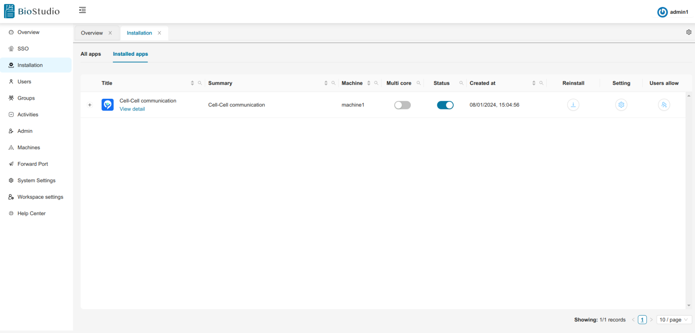  

:diamond_shape_with_a_dot_inside: We can add group and user access controls to determine who is allowed to access these apps.
 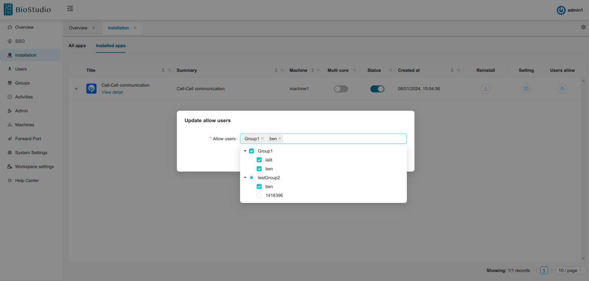  

## Access Cellchat apps.

:diamond_shape_with_a_dot_inside: Click to **Application Icon**.
 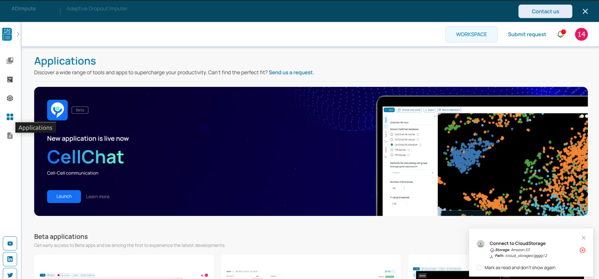  

:bell: **Note**: We can also access application using Launch. I takes time and redirect automatically to Cellchat apps.
 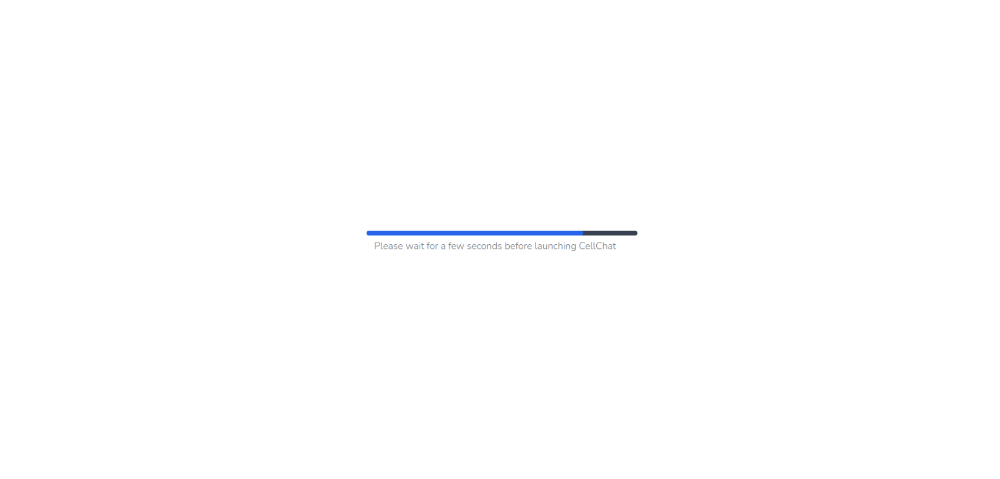  

--**OR**--

:diamond_shape_with_a_dot_inside: Cellchat apps Icon also available on your workspace to launch this application.
 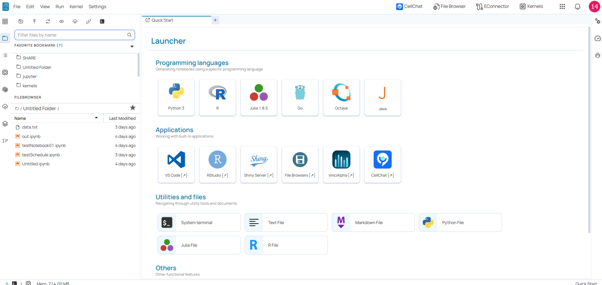  

:diamond_shape_with_a_dot_inside: We can **Reinstall** it by clicking **Reinstall** button.
 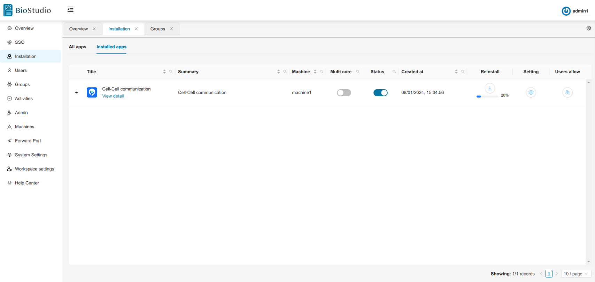  

## Working with Cellchat apps

A demonstration of cell chat apps.

   

:diamond_shape_with_a_dot_inside: Click **Send result to your email** to enable.
 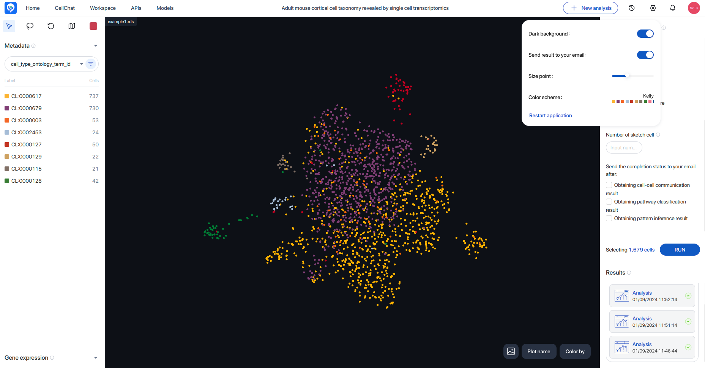  

:bell: **Note**: We can enable email notifications within this app. There are functional sections where users can select preferences based on their requirements separately.

:diamond_shape_with_a_dot_inside: Click **Send result to your email** to enable.
 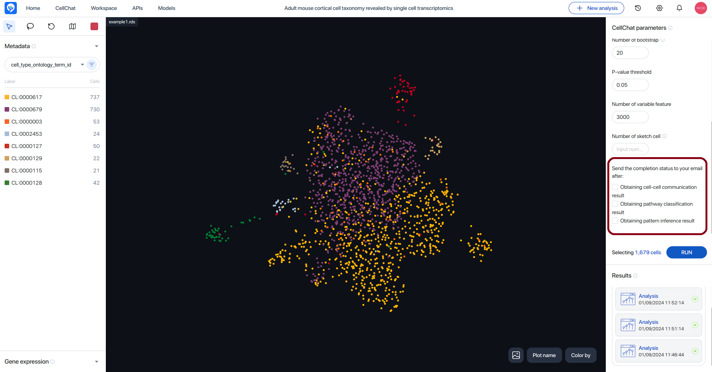  

:diamond_shape_with_a_dot_inside: Once setup. Click to Submit button.
 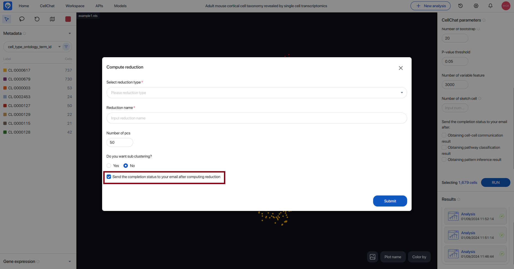  

:diamond_shape_with_a_dot_inside: Once setup. Click to Submit button.
 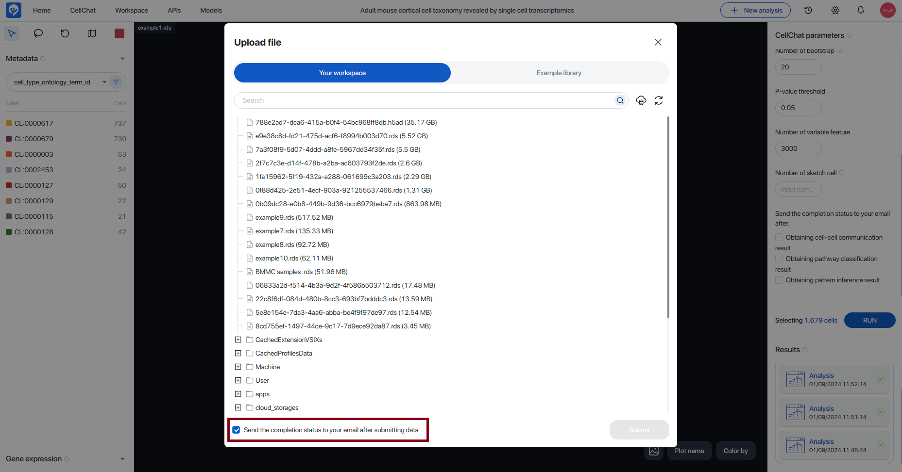  

For more information, please contact us at support@bioturing.com.