## Dashboard training 

**What is a Dashboard in BioStudio?**

```R
Dashboard is a place where administrators can perform all administrative tasks.
```

**How to login with Dashboard?**

```R
BioStudio admin portal can be opened by adding /dashboard to domain name in URL.

https://<Domain Name>/dashboard.
```

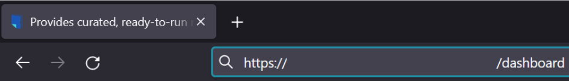 

**What is a Account Registration?**

```R
The admin user must register the account first to have admin login and admin privileges. It can only be performed by a superuser who has root admin credentials. It will create an admin user on the BioStudio system.

Note: You cannot create multiple Super Admin user’s accounts. It can only have one super admin user in the BioStudio system. It is only a one-time activity. Then you can create multiple admin users based on their roles.
```

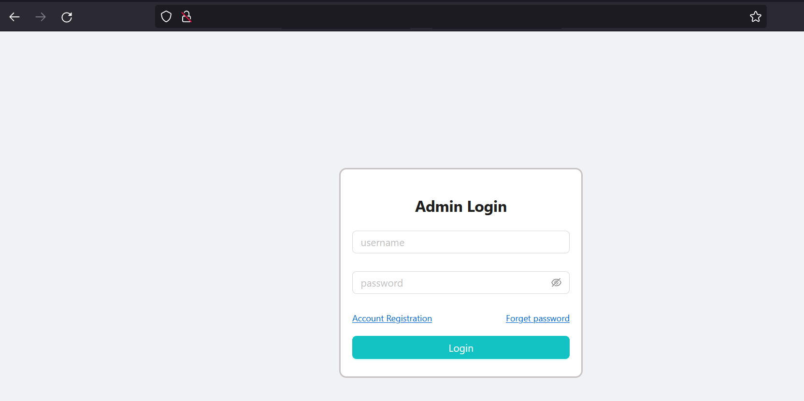

**Create Admin Account.**

- Root Password : This is the password we used to provide during installation.

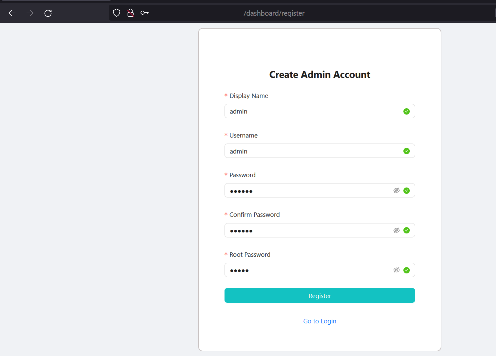

**What is inside dashboard?**

Admin dashboard can view and perform activities below.

**1]** SSO
**2]** Users
**3]** Admin
**4]** Machines
**5]** Forward port
**6]** Settings
**7]** Help Center

**Note:** Some of setting, we already performed during installation and should not do any changes.

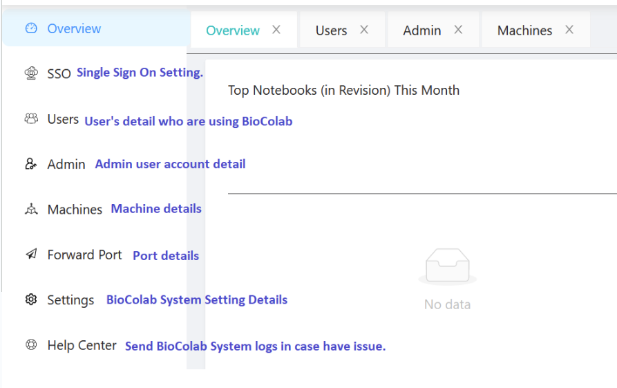

**Admin Tab:**

```R
It used to create multiple admin user accounts based on their roles.
They can login to the dashboard with limited rights.
```

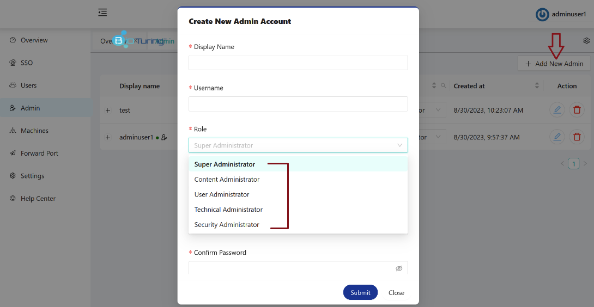

**How to activate and deactivate accounts?**

```R
Super admin can enable or disable that button to change status. A super admin can edit and delete the accounts.
```

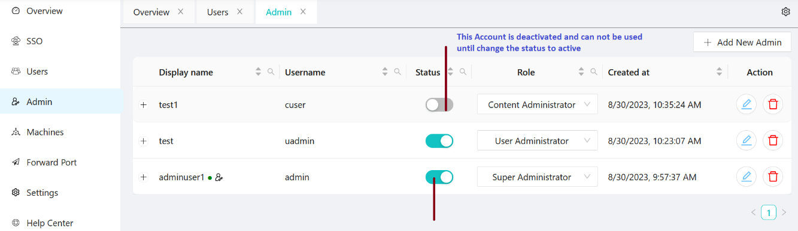


**BioStudio usage and activities:**

```R
BioStudio usage and activity graphs can be deployed automatically based on usage and activities. CPU, RAM, DISK, PROCESS resources, and USER ACTIVITY are all included.
```

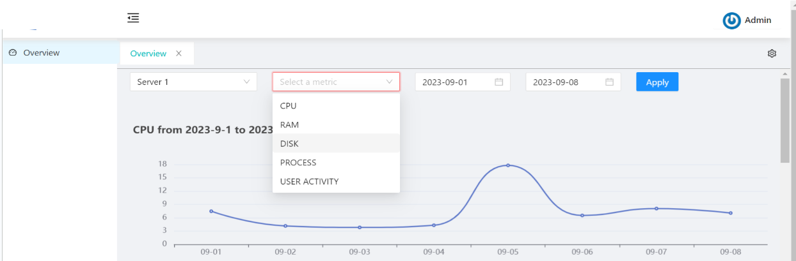

**BioStudio usage and activities:**

```R
A graph will help users see the activities and take appropriate actions.
```

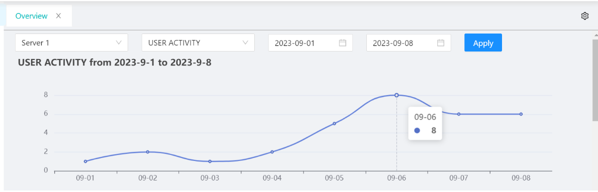

**BioStudio usage and activities:**

```R
Clicking on the dot will give more information about user activities.
```

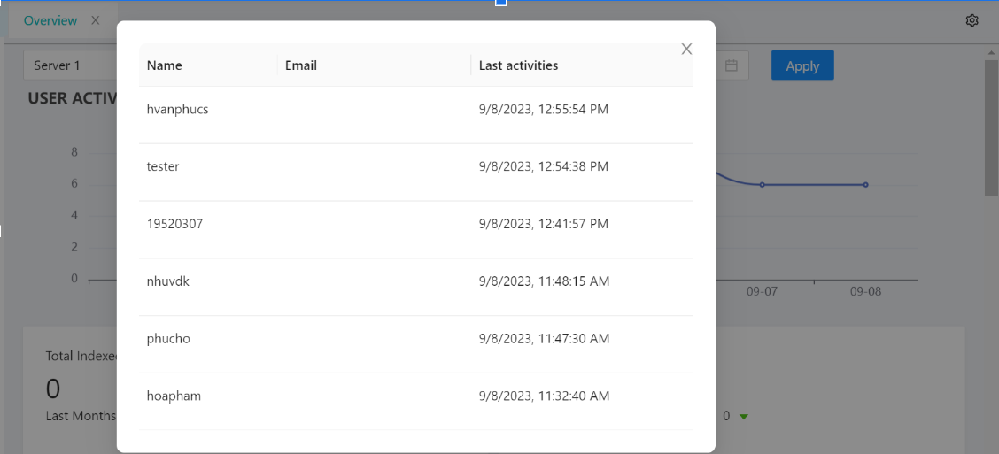

**BioStudio System Setting:**

```R
BioStudio provides super admin control and actions related to the system under the System Setting tab.
```

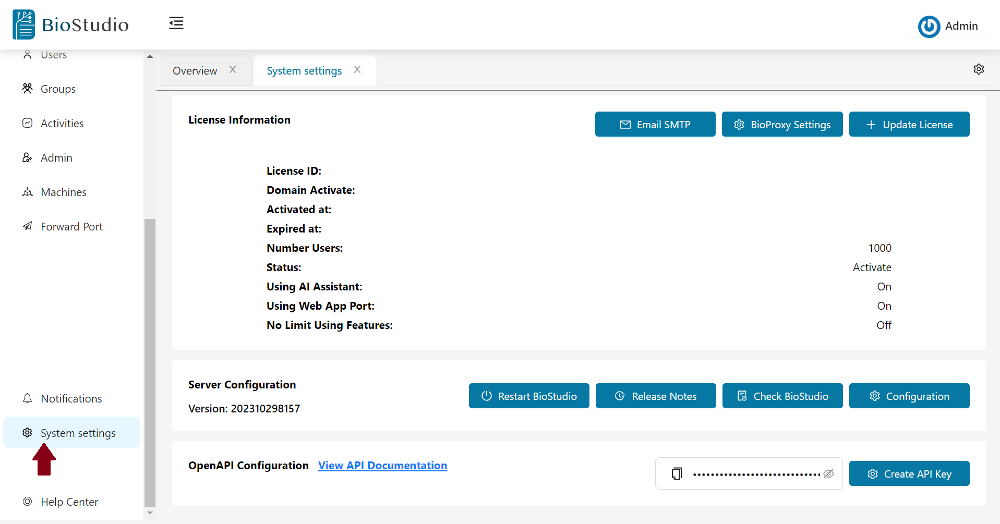

:low_brightness: **Email SMTP**

```R
It used to set up a client SMTP email server, and this facility used to send an email based on process or task completion.
```

:low_brightness: **Restart BioStudio**

```R
When we execute processes that take longer, it's possible that they hold resources for a long time and create zombie processes. It used to clean the hold process and start the BioStudio application.
```

:low_brightness: **Release Notes**

```R
We keep improving, updating BioStudio, and releasing new versions. Clients can review the release notes to see what has changed with the new release.
```
:low_brightness: **Check BioStudio**

```R
It used to check the BioStudio websocket status.
```

**BioStudio login:**

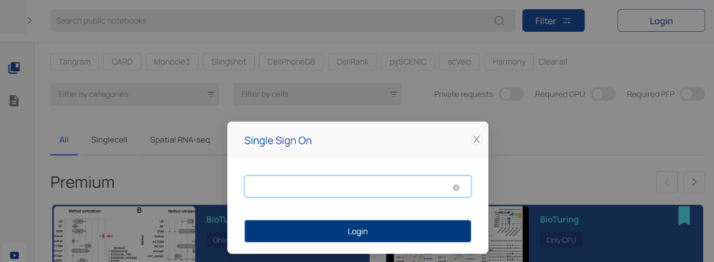

*For every successful login, BioStudio automatically creates a user entry on the Users tab to maintain their usage and status. A user's account can be activated or deactivated by changing its status.*

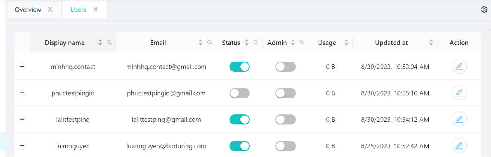

