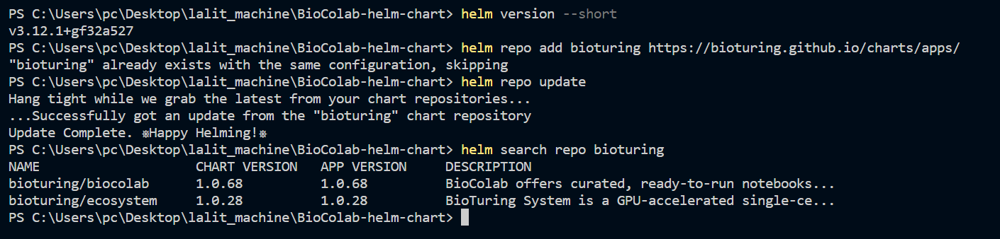
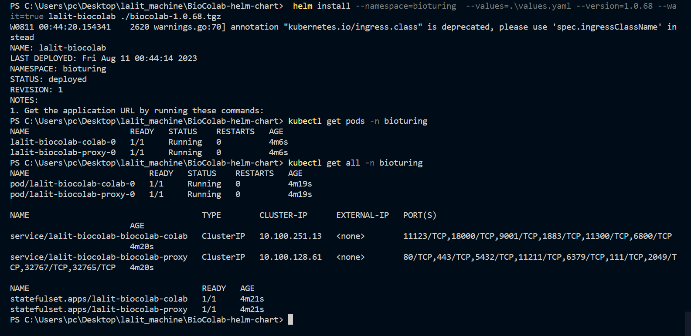
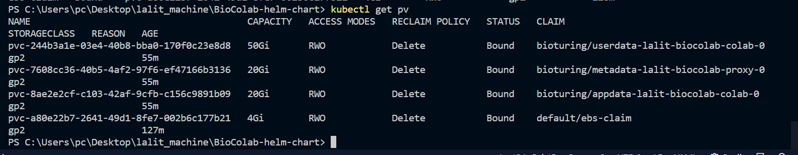

Dear,

Thank you so much to choose BioStudio. Installing BioStudio on Kubernetes is so easy. We just need to use BioStudio Helm Chart and install BioStudio.

## BioStudio Deployments on Kubernetes

Once K8s Cluster is ready. We can follow to install BioStudio using the helm chart.

Network requirements:
Access to these domains is required for the machine with the BioStudio software installed, as we need to retrieve data from the BioTuring ecosystem server.

**Network requirements:**
Access to these domains is required for the machine with the BioStudio software installed, as we need to retrieve data from the BioTuring ecosystem server.

| Domain             | Explain                                                            |
|--------------------|--------------------------------------------------------------------|
| *.bioturing.com    | We need to retrieve data from the BioTuring ecosystem server.      |
| *.anaconda.org     | We need to retrieve packages from the Anaconda server.             |
| *repo.anaconda.com | We need to retrieve packages from the Anaconda repo server.        |
| Amazon S3          | We need to retrieve resources from the BioTuring ecosystem server. |
| github.com         | We need to retrieve packages from the Github. |

**1]** Add bioturing repo.
```R
helm repo add bioturing https://bioturing.github.io/charts/apps/
helm repo update
helm search repo bioturing
```



**2]** Adjust helm chart **value** based on your infrastructure environment.
```R
    PVC
    Resources
    Credentials
```

**3]** Install BioStudio from helm install or GUI.

 
 

For machine creation follow to add local DNS.

```R
We must use local DNS service name to add machine.

<Service Name>.<Namespace>.svc.cluster.local

# bioc-test-release-biostudio-colab.bioc-test.svc.cluster.local

# biocolab-preprod-biostudio-colab.bioturing-preprod.svc.cluster.local
```

Best regards,
