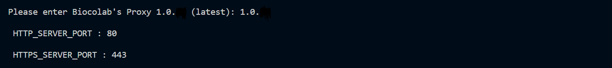

## BioStudio installation using Docker container.

Dear,

We'd like to thank you for choosing **BioStudio**. It is so easy to install. We just need to run installation script and follow the instructions.

Feel free to explore detail information for BioStudio architecture and installation.

**Architecture:**
https://studio.bioturing.com/document/architecture

**Installation:**
https://studio.bioturing.com/document/installation 

**1]** System Requirements


|| **Basic recommendation**| **Optional**|
|---------------------|---------------------------------------------------------------------------------------------------------------------|------------------------------------------------------------------------------------------------------------------|
| **CPU**             | 16 core| This is basic requirement to start  BioStudio and based on requirement, Resources as well as machine can be added.  |
| **RAM**             | 64 Gb | As above                                                                                                           |
| **HDD**             | / partition can be 100 GB | As above.                                                                                      |
|                     | Data Volume : 1TB| As above.                                                                                                |
| **OS**              | Any OS. Ubuntu 20.04 and above.| BioStudio is more supportive with Linux OS. For better performance linux OS is recommended.|
| **AWS Instance**    | Support any type of instance type. Depend on needs| AWS g5xlarge in case using GPU.                                          |
|**Platform**         | Docker / Kubernetes                                                                                                        |

**GPU:** This is optional, If user's want to run notebooks based on GPU, then we need GPU supported instances. We can install BioStudio on any type of instance and in future it can be upgraded to GPU.

**Other:** Yes, other types also support.

**2]**  BioStudio Partition details:

**[1]** app : it used to store application related data. ( **50GB** )
**[2]** metadata : It is used to store postgresql database. ( **50GB** )
**[3]** user : It used to store user's data. Like user's generated notebooks and other works. ( **500GB** to **1024GB** )
**[4]** configs : It used to store server configs. It can be ( **50GB** )

**3]** Domain name:
domain name:  DNS name obtained for BioStudio.

**4]** BioStudio Authentication:
Authentication: **SSO**
BioStudio supports three types of protocol ( **SAML, OPENID and OAUTH2** ) with all types of service providers.

https://studio.bioturing.com/document/installation#kubernetes-setup-for-biostudio

**5]** Network requirements:
Access to these domains is required for the machine with the BioStudio software installed, as we need to retrieve data from the BioTuring ecosystem server.

| Domain             | Explain                                                            |
|--------------------|--------------------------------------------------------------------|
| *.bioturing.com    | We need to retrieve data from the BioTuring ecosystem server.      |
| *.anaconda.org     | We need to retrieve packages from the Anaconda server.             |
| *repo.anaconda.com | We need to retrieve packages from the Anaconda repo server.        |
| Amazon S3          | We need to retrieve resources from the BioTuring ecosystem server. |
| github.com         | We need to retrieve packages from the Github. |


Installation Steps:
Once the machine is ready to install.  

Please **mount** data volume as **/biocolab**

Update **fstab** entry by adding line below.

```R
[Partition-name] /biocolab   xfs    defaults   0   0
```

**1]** Login to the server and create the required folder structure before execution.

```R
mkdir -p /biocolab/metadata
mkdir -p /biocolab/configs
mkdir -p /biocolab/userdata ( minimum 500GB or more )
mkdir -p /biocolab/appdata
```

**2]** Switch to biocolab folder.

```R
cd /biocolab
```

**3]** Download installation script.

```R
wget https://github.com/bioturing/installation/archive/refs/tags/v1.0.52.tar.gz
```


**4]** Uncompressed .gz file.

```R
tar xvf v1.0.52.tar.gz
```


**5]** Switch to the installation folder.

```R
cd installation-1.0.52/
```


 
**6]** Execute installation script.

```R
bash install.biocolab.docker.sh
```

Following script execution instructions: 

**1]** During the execution, It will prompt for “**Install Self-Signed CA Certificate [y, n]**”: **n**
( We can use **n** )


 
**2]** Next it will prompt for folder structure confirmation.

As we already created before. We just need to press the ENTER key to move to the next step.


 
**3]** Script will prompt for Token and Domain name. 

Please use the token provided by us.
Your specific domain name for BioStudio.


**4]** Next step to set up credential for super user account. 
Please provide **password** for Admin user.

**NOTE:** Kindly keep save this password. We can not recovery it once lost.


**5]** Input exposes ports. 
We can use HTTP : 80 and HTTPS : 443

**Note:** If you are installing BioTuring ecosystem and BioStudio on the same machine. Please use different port like 8081 for HTTP and 4433 for HTTPS.


Wait for a while to install docker on your machine.

**6]** Instance / machine type selection ( GPU / CPU )

**Note:** Please be careful to select this option. 
If your instance / machine is based on **GPU**. Please press y to install nvidia cuda driver.
If your instance / machine is based on **CPU**. Please press n to continue to install BioColab.

Do you have a GPU on your machine: [y/n] **n** ( I used n as my machine does not support GPU ). Kindly select **Y** if your machine is having GPU support.

 

==OR==

Do you have a GPU on your machine: [y/n] y (in case you have GPU supported instance and would like to install driver)
– It will download the driver and install it.
– Type accept to move to the next step.


Use the down arrow key to reach **install** option and press enter to start cuda driver installation.


Wait for a while to complete execution to install nvidia driver.

**7]** Do you need install NVIDIA Docker 2 [y, n]:
Please press y if you wish to install Nvidia docker2.

 
**8]** Would you like to change IP:
We can simply press Enter or n. If we do not want to change IP.


**9]** Please enter Biocolab's Proxy 1.0.25 (latest):
We can press enter as it is the latest version.



**10]** Install NFS server [y, n]:
We can simply press Enter or n. If we do not want to install NFS.


Wait for a while to download the Bioproxy image and start the container.


**11]** BioColab version installation.
Just press the ENTER key


Wait for a while to download the BioColab image and start the container.

**12]** check the status:  
docker ps -a
 
Both containers are UP and running.


Once both containers are up and running successfully.

Installation has been completed.


Thank you so much for continue support for us in this set up. Feel free to contact us, If you need any support or have any question for us.

Best regards,