Dear,

Happy to follow next step to setup SSO and Machine.

## BioStudio SSO and Machine Configuration

**SSO:**

**1]** Login to the admin Dashboard using admin credentials.
 Please refer to the link below.

```R
http://<Your BioStudio URL>/dashboard
https://<Your BioStudio URL>/dashboard
```

**2]** Do the **account registration** for Admin login.

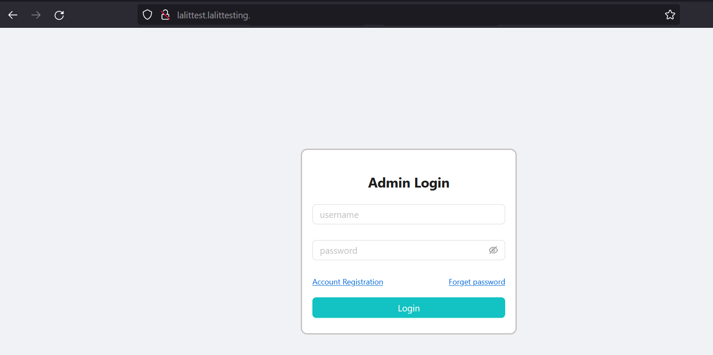


**3]** Create an Admin Account by clicking on **Account Registration**.

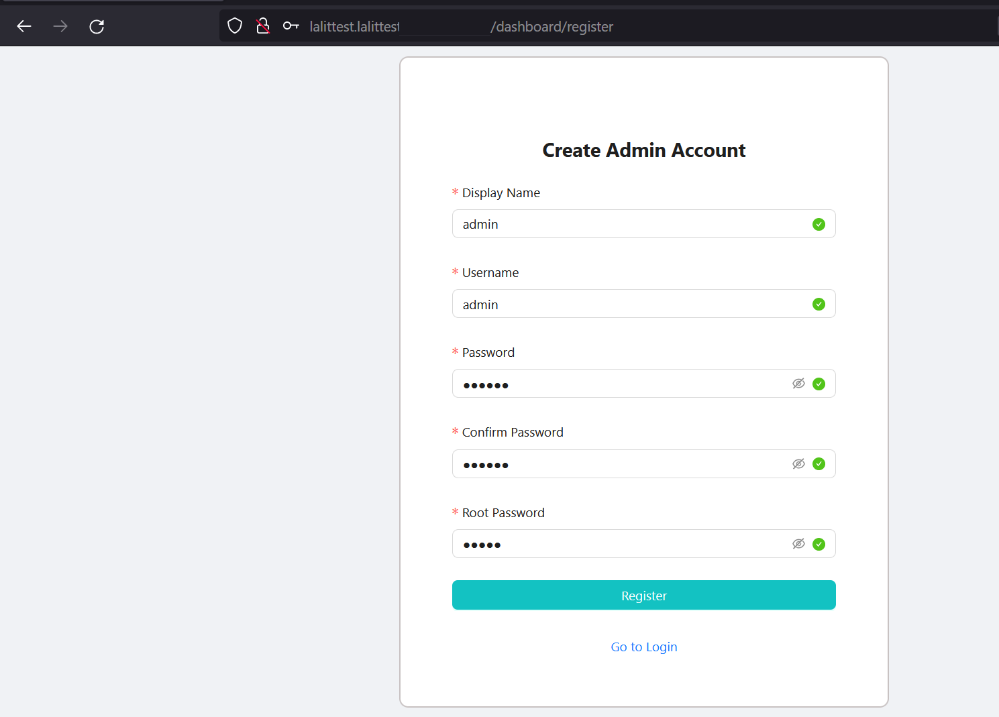


**4]** Login to the dashboard using the Admin account that we registered via the create admin account step.

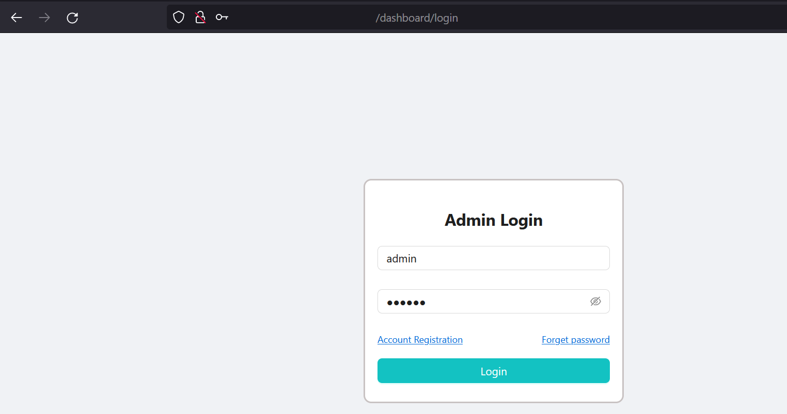

**5]** Admin portal setting will appear on the **left hand side menu**. Please click on **SSO**. Then select **+ Add New SSO**.

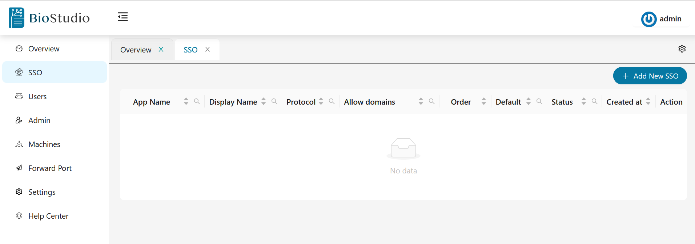

**6] SSO** set up.

Select the protocol that you wish to set up and put some **dummy** values to the **mandatory** field. That we will change once we have correct values after setting up the **callback** URL with **Idp**. Copy callback URL and click on **Submit**.

**NOTE:** SSO configuration should be saved by clicking the **Submit** button as its value would be changed each time, once click add new sso.

– You can have two Callback URLs. Hope SSL certificate already setup for BioStudio domain and HTTPS Callback URL can be used. Copy the Callback URL based on configuration and set up this with IDP.

-- BioStudio supports three types of protocol ( SAML, OPENID and OAUTH2 ) with all types of service providers.

https://studio.bioturing.com/document/installation#p-stylecolor-000080-sso-set-up-p

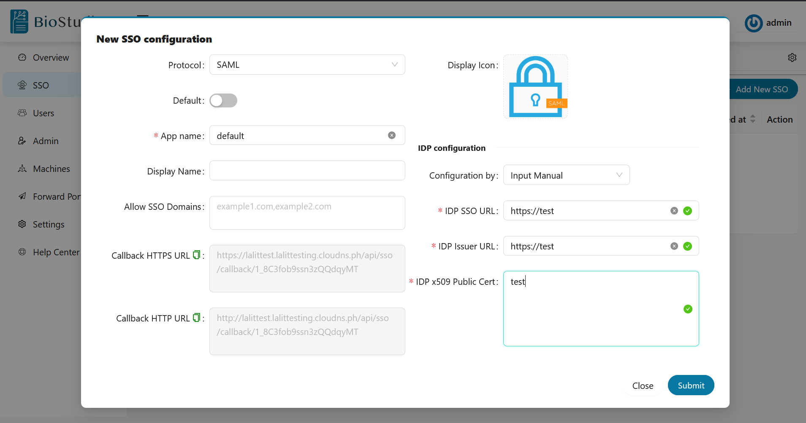

**7]** Update SSO setting.

Once set up the Callback URL with IDP. Get all mandatory values and update SSO settings. 
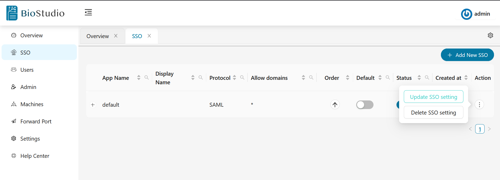

```R
     --> Login to admin dashboard. https://<Your Domain>/dashboard
     --> Select SSO and click on three dots on Action tab.
     --> Click on Update SSO.
     --> Replace dummy values with correct values and set up other values like Allow 
```
SSO domains and save the configuration.

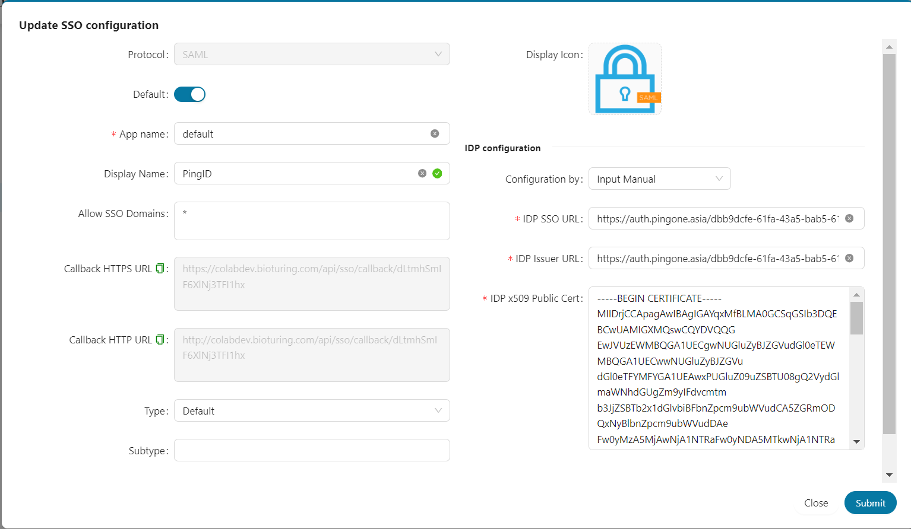


## Machine Creation:

Machine Creation: In order to create workspace for the user and save data. We need to create machine and volume. Detail are in link below.

https://studio.bioturing.com/document/installation#machine-creation

**1]** Log to the admin dashboard.

```R
– Click on Machine settings on the left hand side menu.
– We can give any name to the machine 
– IP address: this is a private IP of the server. You can get this from the command below.
```

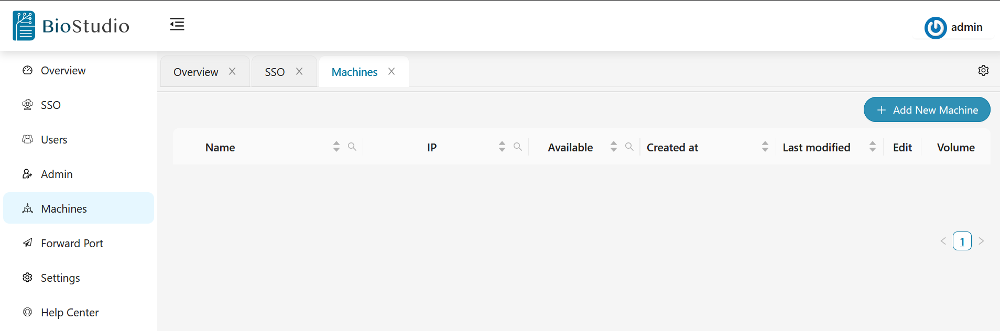

```R
docker exec bioproxy cat /etc/hosts
```

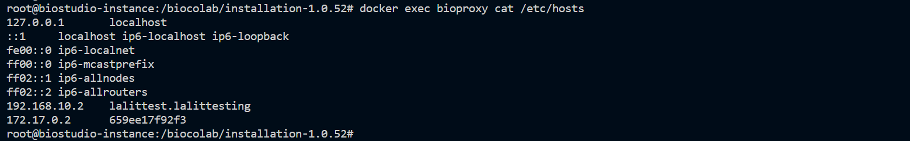

**2]** fill all mandatory Make it **Available** by enabling it. Click on **Submit** button to save this setting.

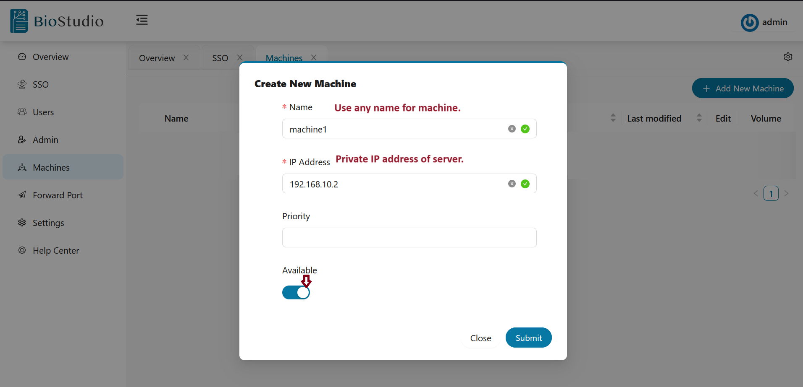

**3]** Volume creation.

**Volume Creation:**

– Once machine creation is completed. Click on **+ plus** sign of volume tab to create volume.
– We can use any name for Volume name.
– Volume path would be **/home**
– Make it **Available** by enabling it.
– Click on **Submit** button to save this configuration.

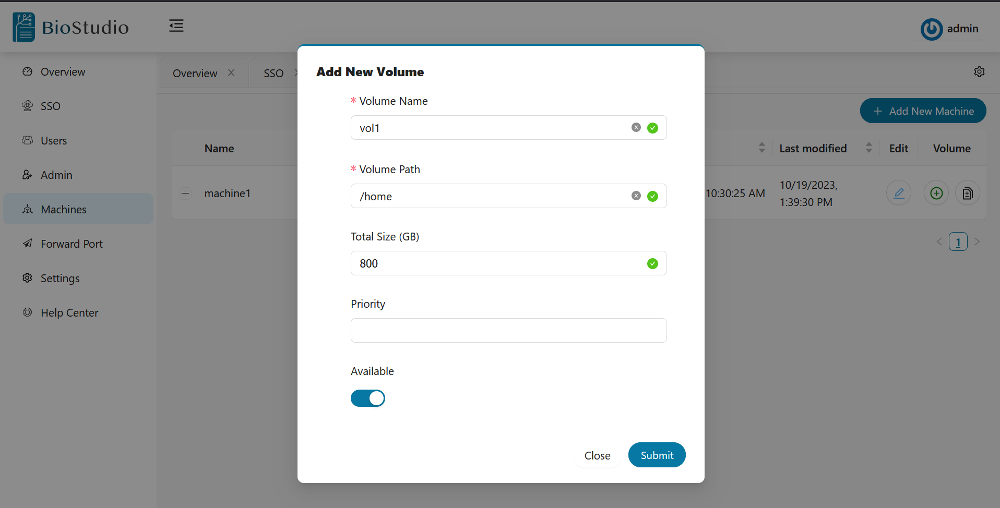

**Testing**

User Testing:
Below is the user credential for testing. It will work without SSO configuration.


User Name: tester@bioturing.com
Password: tester@123

Thank you so much for continue support for us in this set up. Feel free to contact us, If you need any support or have any question for us.

Best regards,
