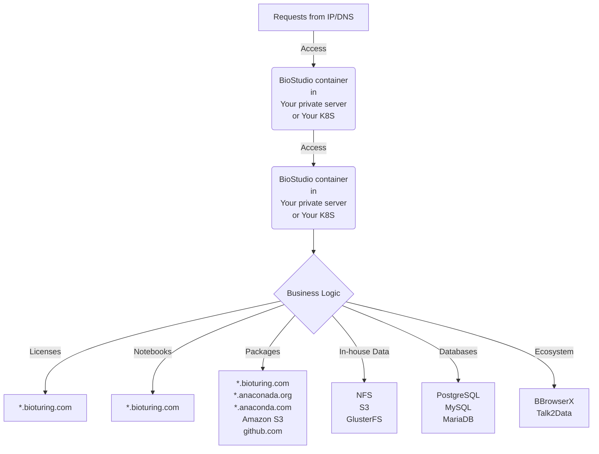
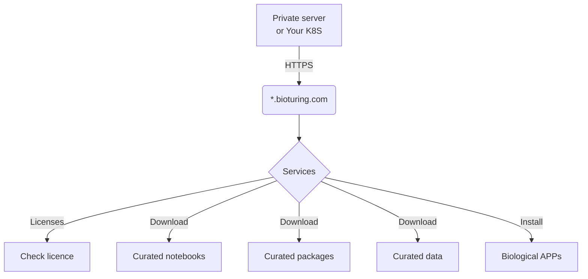
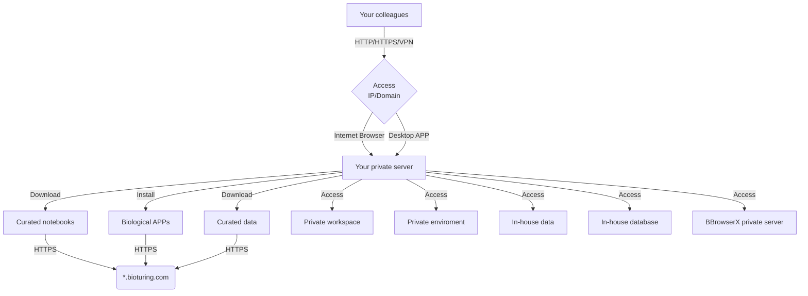
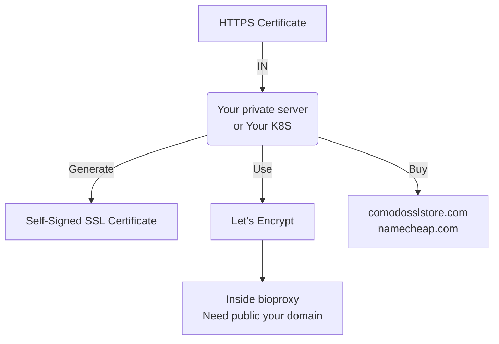
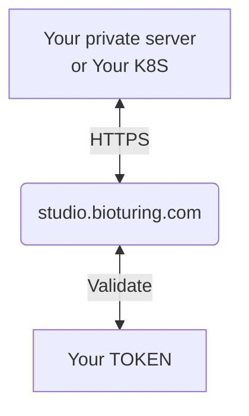
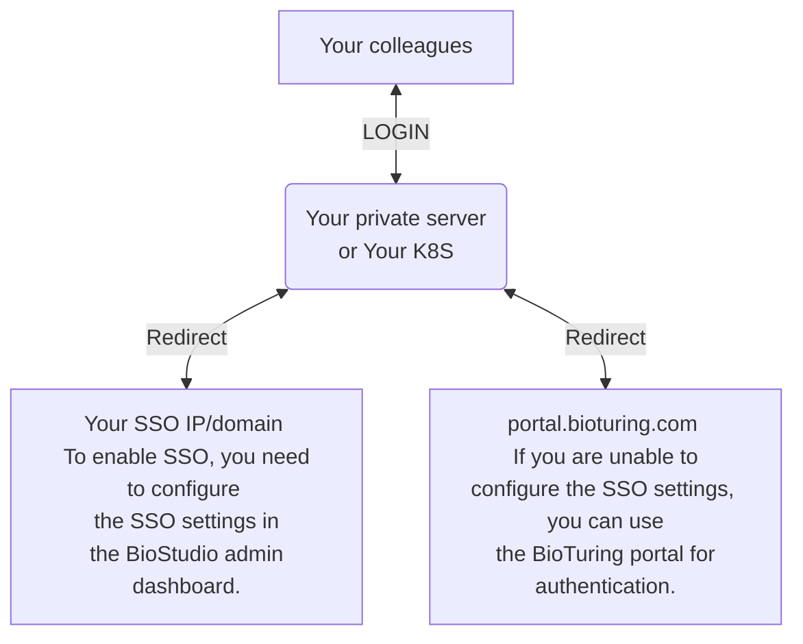
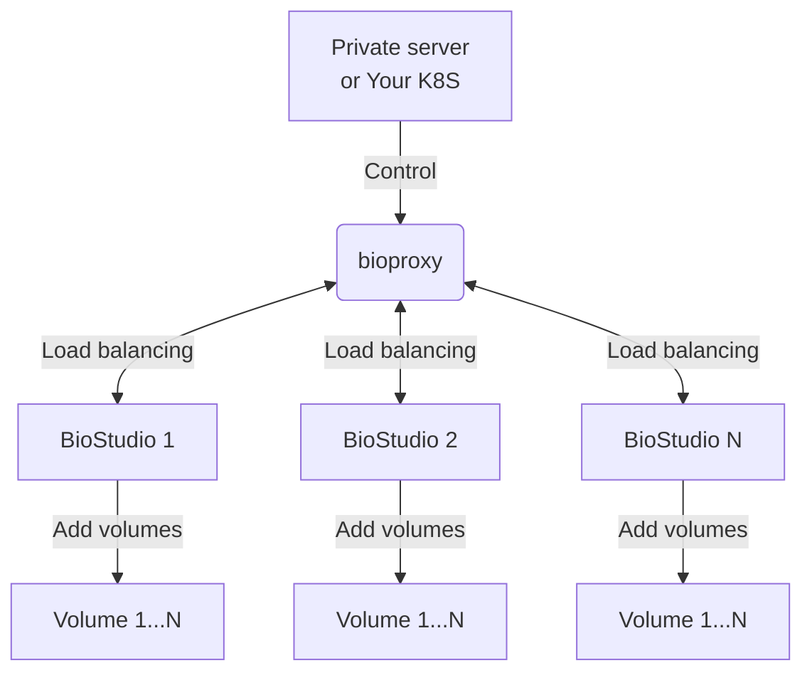

# **Architecture Diagram**

## **Overview**

 

The BioStudio architecture diagram provides a comprehensive overview of the system's components and their relationships. It illustrates how different services and systems interact with each other and with all other services in detail.

## **On private server / K8S**

 

### 1. Preparing the platform setup

 

**Our product consists of containerized applications that can be deployed on Docker using the Docker engine (docker, containerd) as well as on Kubernetes.**

To install BioStudio on your private server, the following requirements must be met:

#### System requirements

| 
OS system
 | 
Version
      |
| :---------------------------------------------- | :------------------------------------------------- |
| Centos                                          | 6.5 or above recommended - https://www.centos.org/ |
| Readhat                                         | Any - https://www.redhat.com/en                    |
| Debian                                          | 10 or above recommended - https://www.debian.org/  |
| Ubuntu                                          | 18.04 or above recommended - https://ubuntu.com/   |

#### Hardware requirements

| 
Hardware
 | 
Size
   |
| :--------------------------------------------- | :------------------------------------------- |
| CPUs                                           | 16 cores or above recommended                |
| GPUs                                           | <strong style="color:red;">Optional</strong> |
| MEMORY                                         | <strong style="color:red;">64GB</strong> or above recommended                   |
| APP-STORAGE                                    | 100GB or above recommended                    |
| METADATA-STORAGE                               | 50GB or above recommended                    |
| USER-STORAGE                                   | 500GB or above recommended                   |
| SSL-STORAGE                 | 1GB or above recommended |
| RUNTIME-ENGINE                                 | Docker/Containerd, or Kubernetes             |

#### Network requirements

Access to these domains is required for the machine with the BioStudio software installed, as we need to retrieve data from the BioTuring ecosystem server.

| 
Domain
 | 
Explain
                      |
| :------------------------------------------- | :----------------------------------------------------------------- |
| \*.bioturing.com                             | We need to retrieve data from the BioTuring ecosystem server.      |
| \*.anaconda.org                              | We need to retrieve packages from the Anaconda server.             |
| \*repo.anaconda.com                          | We need to retrieve packages from the Anaconda repo server.        |
| Amazon S3                                    | We need to retrieve resources from the BioTuring ecosystem server. |
| `github.com`                                    | We need to retrieve packages from the Github. |

#### Application services

| 
Service
 | 
Explain
                                                                                                                                                                                                                              |
| :-------------------------------------------- | :------------------------------------------------------------------------------------------------------------------------------------------------------------------------------------------------------------------------------------------------------------------------- |
| bioproxy                                      | Within this image, you will find a comprehensive set of features, such as an HTTP/HTTPS server with load balancing, an NFS server, and Minio S3, in addition to metadata databases like PostgreSQL, Redis, and Memcached, all of which are used by the BioStudio instance. |
| BioStudio                                     | You will have access to all the necessary features, such as workspaces, notebooks, and various software applications that your colleagues use, through this image.                                                                                                         |

#### Service ports

| 
Service
 | 
Exposed Port
                                                                                                                                                                                                                                                                                                 |
| :-------------------------------------------- | :------------------------------------------------------------------------------------------------------------------------------------------------------------------------------------------------------------------------------------------------------------------------------------------------------------------------------------------------- |
| bioproxy                                      | <strong style="color:red;">HTTP (80)</strong> - We can change the this port. You may share this setting with your colleagues: http://your_private_server_ip_or_domain:<strong style="color:red;">PORT</strong>. This setting will enable your colleagues to access BioStudio private server through either a web browser or desktop application.   |
| bioproxy                                      | <strong style="color:red;">HTTPS (443)</strong> - We can change the this port. You may share this setting with your colleagues: http://your_private_server_ip_or_domain:<strong style="color:red;">PORT</strong>. This setting will enable your colleagues to access BioStudio private server through either a web browser or desktop application. |
| bioproxy                                      | MEMCACHED (11121) - This port is restricted to LAN networks and is used to connect between bioproxy and BioStudio.                                                                                                                                                                                                                                 |
| bioproxy                                      | REDIS (6379) - This port is restricted to LAN networks and is used to connect between bioproxy and BioStudio.                                                                                                                                                                                                                                      |
| bioproxy                                      | POSTGRESQL (5432) - This port is restricted to LAN networks and is used to connect between bioproxy and BioStudio.                                                                                                                                                                                                                                 |
|                                               |                                                                                                                                                                                                                                                                                                                                                    |
| BioStudio                                     | <strong style="color:red;">WORKSPACE (18000) - This port is restricted to LAN networks and is used to connect between bioproxy and BioStudio.</strong>                                                                                                                                                                                             |
| BioStudio                                     | <strong style="color:red;">APP (11123) - This port is restricted to LAN networks and is used to connect between bioproxy and BioStudio.</strong>                                                                                                                                                                                                   |
| BioStudio                                     | MQTT-WEBSOCKET (9001) - This port is restricted to LAN networks and is used to connect between bioproxy and BioStudio.                                                                                                                                                                                                                             |
| BioStudio                                     | MQTT-TCP (1883) - This port is restricted to LAN networks and is used to connect between bioproxy and BioStudio.                                                                                                                                                                                                                                   |
| BioStudio                                     | JOB (11300) - This port is restricted to LAN networks and is used to connect between bioproxy and BioStudio.                                                                                                                                                                                                                                       |

### 2. Internal service workflow

 

It is possible to install both the <strong style="color:red">bioproxy</strong> and <strong style="color:red">BioStudio</strong> Docker images on a single physical machine.

Using the machine that has the <strong style="color:red">BBrowserX private server</strong> installed can help you optimize your costs.

### 3. Connection workflow

 

Connection workflow refers to the sequence of steps or processes that are involved in establishing and managing connections between two or more systems, devices, or applications.

### 4. User access workflow

 

### 5. Setup HTTPS workflow

 

SSL Certificate : Software supports HTTPS protocol. SSL can be configured later after installation too.

After installing your private server, you can update your SSL by accessing the dashboard at `http://your private server ip or domain:port/dashboard` and selecting Settings > Update SSL.

### 6. What is the process to activate your BioStudio private server?

 

To activate the BioStudio private server, you need to have a token that is obtained from BioTuring.

After installing your private server, you can update your BioStudio token by accessing the dashboard at `http://your private server ip or domain:port/dashboard` and selecting Settings > Update BioStudio Token.

 

### 7. How can you utilize your company's SSO for accessing your BioStudio private server?

 

BioStudio supports various SSO protocols including SAML, OAuth2, and OpenID, as well as popular social SSO options like AzureAD, Okta, Apple, Twitter, LinkedIn, Google, and Github.

### 8. What is the process for scaling in/out your BioStudio private server?

 

Bioproxy and BioStudio (Docker images) can be installed on multiple machines. However, only one Bioproxy instance is needed to balance the load across all BioStudio instances.

## **On BioTuring cloud**

 

It is the on-demand availability of computer system resources, especially data storage (cloud storage) and computing power, without direct active management by the user.

For any query and support. Kindly contact us: [:email: support@bioturing.com](mailto:support@bioturing.com)
