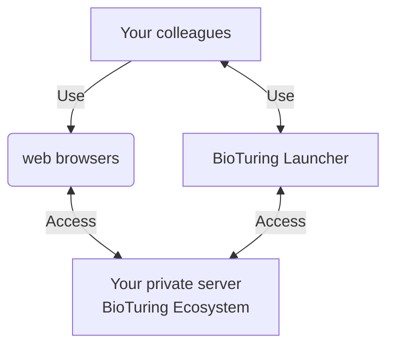

# BioTuring Launcher

BioTuring ecosystem is a web application, that means you can access the system anywhere when just having a modern web browser (Chrome, Edge, Safari).

When you don't have SSL but operate in a secured local network or VPN, you can use a **BioTuring launcher**, a light-weight desktop application that supports users to easily access all applications belong to the BioTuring ecosystem.

## When should I use BioTuring Launcher?

If you haven't configured an SSL certificate and you operate in a secured local network or VPN.

This software is compatible with both MacOS and Microsoft Windows operating systems.

 

**BioTuring launcher interface**
BioTuring Launcher interface displays all accessible applications in the BioTuring ecosystem. Additionally, the top bar provides users with easy access to various menus such as setting, bookmark management, contact, and help.

## Where can I download BioTuring Launcher?

- To download the software for MacOS, use <a target="_blank" href="https://cdn.bioturing.com/static/apps/launcher/blauncher.macos.1.0.1.zip">this link</a>.

- To download the software for Windows, use <a target="_blank" href="https://cdn.bioturing.com/static/apps/launcher/blauncher.winos.1.0.1.zip">this link</a>.

If you have any questions about BioStudio, please contact us at <a href="mailto:support@bioturing.com">support@bioturing.com</a>

## How to use BioTuring Launcher?

### Initiation

To access the BioTuring Launcher application after downloading and extracting the zip file, follow the instructions based on your operating system:

**For Windows**:

1. Locate the extracted folder that contains the BioTuring Launcher shortcut.
2. Double-click on the BioTuring Launcher shortcut.

This will launch the BioTuring Launcher application on your Windows system.

**For macOS**:

1. Find the extracted folder that contains the BioTuring Launcher shortcut.
2. Right-click on the BioTuring Launcher shortcut.
3. From the context menu that appears, select "Open".

MacOS has additional security measures that may display a warning when launching applications from unidentified developers. By selecting "Open" from the context menu, you can bypass this warning and launch the BioTuring Launcher application.

### Setting

For the initial use, you are required to set up a web domain for each application that belongs to the BioTuring ecosystem. Filling out the following fields then hit the "Save" button to save.

 
 

To share this domain information with your colleagues, click on the Export button to get the configuration file.

 
 

They can then set up the same domain by importing your shared file.

 
 

This how it looks like after importing the configuration file. Finally press the "Save" button to finish your setting.

 
 

Once the domain is established, you can easily access any application belonging to the BioTuring ecosystem by clicking on the shortcut of each tool on the home page.

### Bookmark

BioTuring Launcher supports users to effectively manage their bookmarks and access them easily through BioTuring applications.

To add a bookmark in BioTuring Launcher, follow these steps:

- Click on "Add URL".
- Enter the URL of the link you want to record.
- Enter a display name for your bookmark.
- Select the folder where you want to save your bookmark.
- Click on "Save and Open" to save the bookmark and open the link.

 
 

A notification pop-up will appear to announce the successful addition.

 
 

BioTuring Launcher also supports importing all your bookmarks from Chrome by the following steps:

- Access the **Bookmark Manager** in Chrome and export all of your bookmarks.

 
 

- In BioTuring Launcher, open "Add URL", click on the "Import" button, choose the bookmark exported file from Chrome.

 
 

You can now manage all of your bookmarks by clicking on "Bookmark" in the top menu of the Launcher.

 
 

For more information, please contact us at <a href="mailto:support@bioturing.com">support@bioturing.com</a>.
