**Set up a custom environment for analyses in BioStudio**

:o: **Understanding Environments and Kernel**

**Packages & Environment:**
BioStudio currently using conda manager. Conda is an open-source package management system and environment management system. A conda environment is a directory that contains a specific collection of conda packages that you have installed.

For example:

you may have one environment with NumPy 1.7 and its dependencies, and another environment with NumPy 1.6 for legacy testing. If you change one environment, your other environments are not affected. You can easily activate or deactivate environments, which is how you switch between them. You can also share your environment with someone by giving them a copy of your **environment.yaml** file.

[Conda Document](https://docs.conda.io/projects/conda/en/latest/)

:o: There are many ways to setup environment in BioStudio.

:one: **Using BioStudio CLI**

| **Task**                             | **Conda package and environment manager command**     | **Pip package manager command**                                       | **Virtualenv environment manager command**            |
|--------------------------------------|-------------------------------------------------------|-----------------------------------------------------------------------|-------------------------------------------------------|
| Install a package                    | `conda install $PACKAGE_NAME`                         | `pip install $PACKAGE_NAME`                                           | X                                                     |
| Update a package                     | `conda update --name $ENVIRONMENT_NAME $PACKAGE_NAME` | `pip install --upgrade $PACKAGE_NAME`                                 | X                                                     |
| Update package manager               | `conda update conda`                                  | Linux/macOS: `pip install -U pip` Win: `python -m pip install -U pip` | X                                                     |
| Uninstall a package                  | `conda remove --name $ENVIRONMENT_NAME $PACKAGE_NAME` | `pip uninstall $PACKAGE_NAME`                                         | X                                                     |
| Create an environment                | `conda create --name $ENVIRONMENT_NAME python`        | X                                                                     | `cd $ENV_BASE_DIR`; `virtualenv $ENVIRONMENT_NAME`    |
| Activate an environment              | `conda activate $ENVIRONMENT_NAME*`                   | X                                                                     | `source $ENV_BASE_DIR/$ENVIRONMENT_NAME/bin/activate` |
| Deactivate an environment            | `conda deactivate`                                    | X                                                                     | deactivate                                            |
| Search available packages            | `conda search $SEARCH_TERM`                           | `pip search $SEARCH_TERM`                                             | X                                                     |
| Install package from specific source | `conda install --channel $URL $PACKAGE_NAME`          | `pip install --index-url $URL $PACKAGE_NAME`                          | X                                                     |
| List installed packages              | `conda list --name $ENVIRONMENT_NAME`                 | `pip list`                                                            | X                                                     |
| Create requirements file             | `conda list --export`                                 | `pip freeze`                                                          | X                                                     |
| List all environments                | `conda info --envs`                                   | X                                                                     | `Install virtualenv wrapper`, then `lsvirtualenv`     |
| Install other package manager        | `conda install pip`                                   | `pip install conda`                                                   | X                                                     |
| Install Python                       | `conda install python=x.x`                            | X                                                                     | X                                                     |
| Update Python                        | `conda update python*`                                |                                                                       |                                                       |

[Command reference ](https://conda.io/projects/conda/en/latest/commands/index.html)

**CONDA CHEAT SHEET**

- Getting help
  
```R
# Display Conda version with conda --version
conda --version 

# Display Conda system info with conda info
conda info
```

- Listing packages

```R
# List all installed packages with conda list
conda list

# List all installed packages matching a regular expression with conda list {regex}
conda list ^z # lists packages with names starting with z

# List all versions of all packages in all conda channels with conda search
conda search

# List all versions of a package (all channels) with conda search {pkg}
conda search scikit-learn

# List specific versions for a package (all channels) with conda search '{pkg}{version}'
conda search 'scikit-learn>=1'

# List package versions in a specific conda channel with conda search {channel}::{pkg}
conda search conda-forge::scikit-learn
```

- Installing & managing packages

```R
# Install packages with conda install {pkg1} {pkg2} ...
conda install numpy pandas 

# Install specific version of package with conda install {pkg}={version}
conda install scipy=1.10.1

# Update all packages with conda update --all
conda update --all

# Uninstall packages with conda uninstall {pkg}
conda uninstall pycaret
```

Anaconda has traditionally used conda as its package manager, but over time it has become quite slow at resolving dependencies when installing packages. **mamba** is a re-implementation of conda written in C++ offering the following benefits:

- parallel downloading of repository data and package files using multi-threading.
  
- libsolv for much faster dependency solving, a state of the art library used in the RPM package manager of Red Hat, Fedora and OpenSUSE.
  
- core parts of mamba are implemented in C++ for maximum efficiency.
  
At the same time, mamba utilises the same command line parser, package installation code and transaction verification routines as conda to stay as compatible as possible.

**Why Mamba?**

Put simply, in a lot of cases mamba is a lot faster at installing packages when compared to conda.

```R
mamba install -c anaconda pytest-shard
```

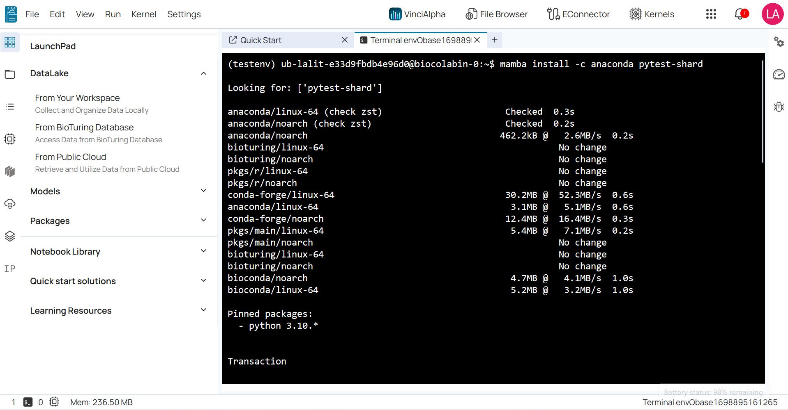


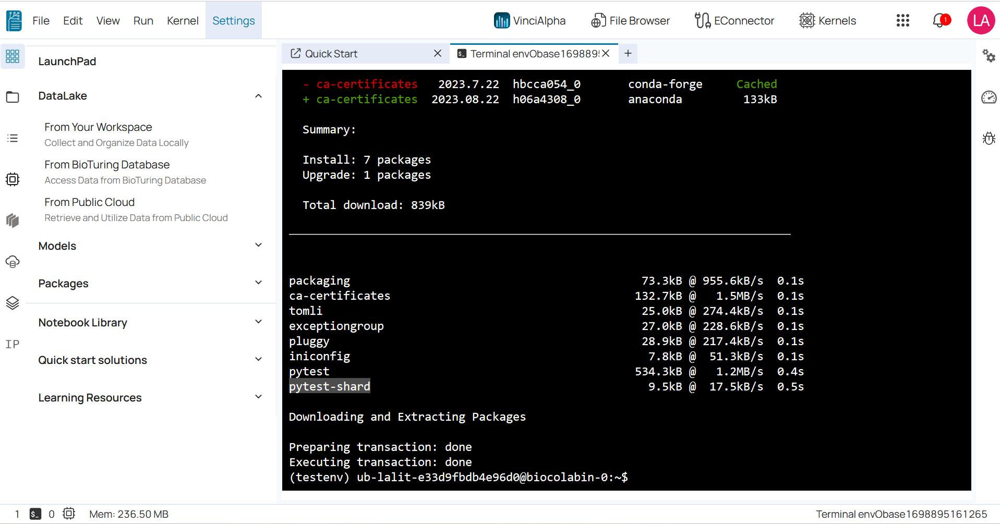

- Working with channels
  
```R
# List channels with conda config --show channels
conda config --show channels

# Add a channel (highest priority) with conda config --prepend channels {channel}
conda config --prepend channels conda-forge

# Add a channel (lowest priority) with conda config --append channels {channel}
conda config --append channels bioconda
```

- Working with environments
  
```R
# List environments with conda env list
conda env list

# Add --name {envname} to other commands to restrict their use to that environment
conda list --name base
conda install scikit-learn --name myenv 
```

- Managing environments
  
```R
# Create an environment for technology with conda create -n {env}
conda create --name my_python_env

# Clone an existing environment with conda create --clone {old_env} --name {new_env}
conda create --clone template_env --name project_env

# Create an environment auto-accepting prompts with conda create --yes --name {env}
# For non-interactive usage
conda create --yes --name my_env

# Make environment the default environment with conda activate {env}
# This prepends the environment directory to the system PATH environment variable
conda activate my_env

# Make the base environment the default with conda deactivate {env}
# This removes the environment directory from the system PATH environment variable
conda deactivate my_env
```

- Sharing environments

```R
# Export active environment to a YAML file with conda env export > environment.yml
# Export every package including dependencies (maximum reproducibility)
conda env export > environment.yml
# Export only packages explicitly asked for (increased portability)
conda env export --from-history > environment.yml

# Import environment from YAML file with conda env create --name {env} --file {yaml_file}
conda env create --name my_env2 --file environment.yml

# Export list of packages to TEXT file with conda list --export > requirements.txt
# Usually requires manual editing; you can also use pip freeze
conda list --export > requirements.txt

# Import environment from TEXT file with conda create --name {env} --file {yaml_file}
conda create --name my_env --file  requirements.txt
```

:two: **Using web UI interface**

:arrow_forward: Click on **Package Environments** icon on left side menu.


-- **OR** --

:arrow_forward: Click on **Menu Icon** located at right side on the menu bar.


:arrow_forward: **Conda environments** utilities can be used based on requirement.


:arrow_forward: **Create New Environment**

```R
Create new environment is used to create an environment there you can install all require packages.

Provide environment name on name field.

Select require language that you would like to have in environment.

Click on OK button to process next step.

```


:high_brightness: **It will start to create new environment.**

```R
Once followed above step. It will start to create environment.
```

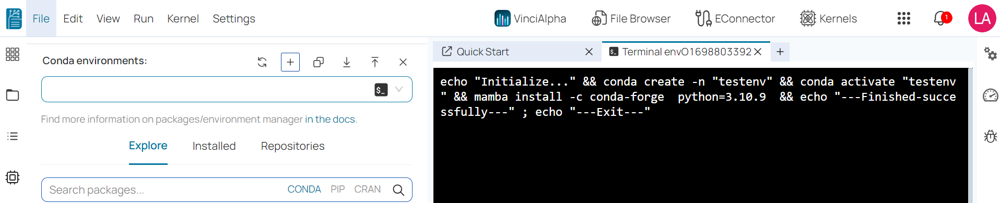

:high_brightness: **Once created. It will activate too.**

```R
Environment has been activated.
```


:high_brightness: **Refresh conda environment and we can see new environment in this list.**

```R
All the custom environment can be viewed by refresh environmental list.
```


:high_brightness: **Click on Open Terminal with activate environment to activate.**

```R
In order to activate specific environment from the list. Click on Open Terminal with activate environment.
```


:high_brightness: **We can create similar environment by clone.**

```R
We can create the similar environment from existing environment.
```


:high_brightness: **Refresh conda environment to see all custom environment.**

```R
All the custom environment can be viewed by refresh environmental list.
```


:high_brightness: **We can create environment by upload environment file using Import new Environment feature.**

```R
Using this feature we can import environmental and create environment.  
```


:high_brightness: **We can export environment using Export Environment utility.**

```R
BioStudio providing features to export existing environment for future use.
```

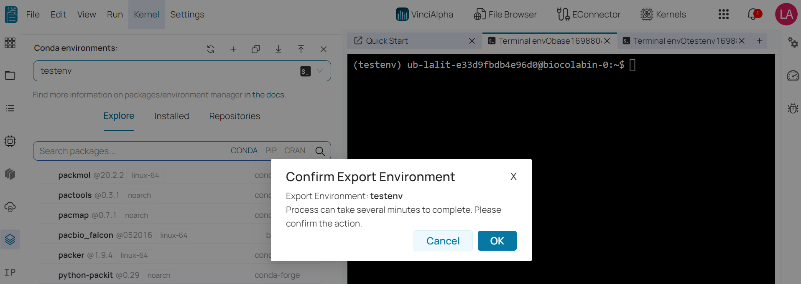

:high_brightness: **Download YAML file to export environment.**

```R
Once environment is ready. You can download it on your local.
```


:arrow_forward: **Install package**

```R
You can install any package to your environment from available package on Explore / Repositories.
```

:arrow_forward: **Explorer**

```R
Here, we can see some of important conda package available.
```

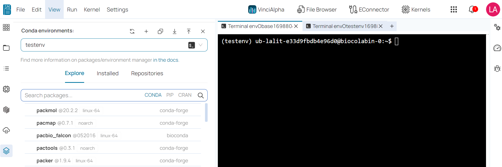


```R
Here, we can see some of important packages available on the list.

# Select specific package that you would like to install with this environment.
# Select package version.
```

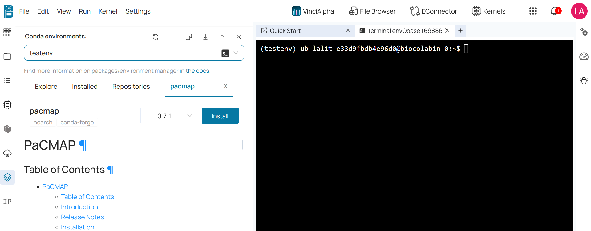


```R
# Click on Install.
```


```R
# Click on OK to confirm installation package.
```

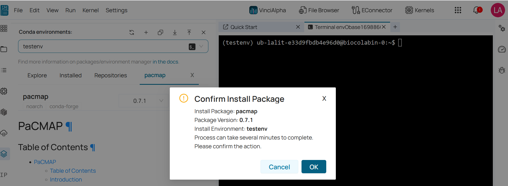


```R
# Package has been install.
```

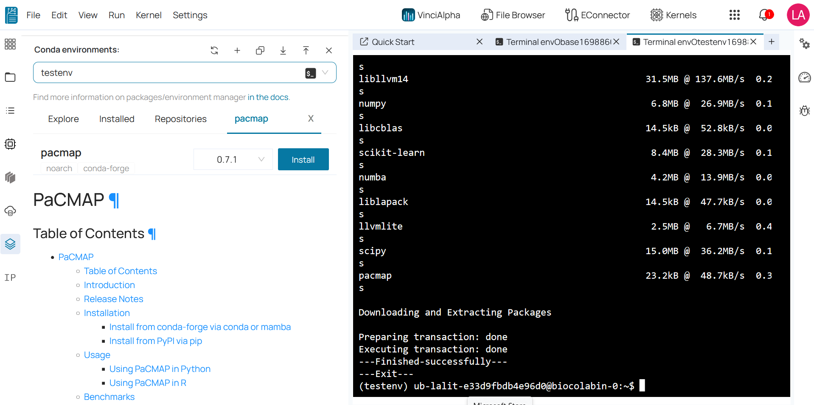

:arrow_forward: **Installed**

```R
Package would be listed on installed list.
```

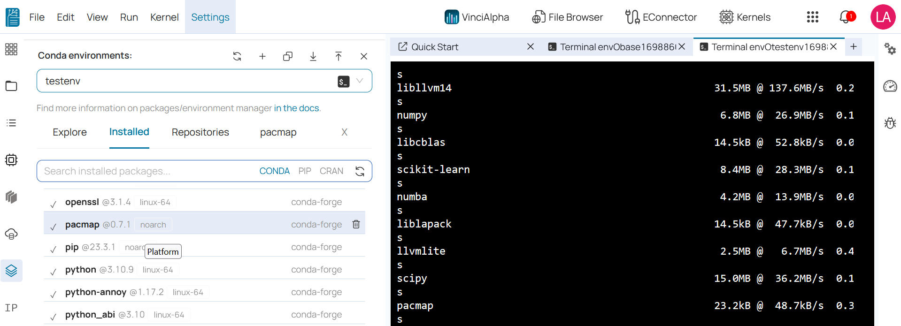

:arrow_forward: **Repository**

```R
BioStudio provides a feature to install package from repository.
```


```R
# Please type Git repository URL and click on Check.
# Select package language.
```


```R
# It will prompt for branch. By default it will be main branch.
# Click on install.
```


```R
# Package from repository has been installed.
```


:arrow_forward: **Delete Package**

```R
# Package can be deleted by clicking delete icon.
```

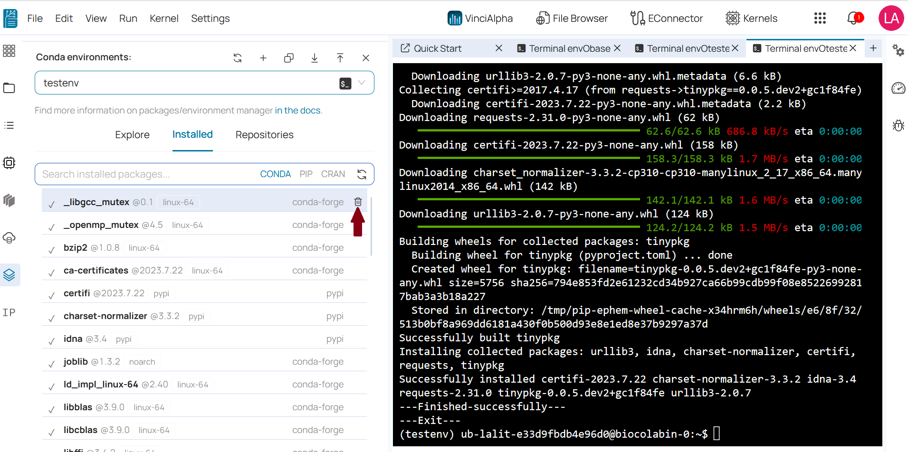

:arrow_forward: **Delete Environment**

```R
Environment can be deleted by clicking delete Environment button.

# Click on Delete Environment button.
```


```R
# Click on OK while prompting confirmation.
```


---

**Kernels:** Are specific instances of a programming environment that BioStudio uses to execute code in a notebook. Each kernel corresponds to a particular environment. This means that you can have multiple kernels running concurrently, each associated with a different environment.

- Isolation: Environments provide isolation, meaning that the packages and dependencies for one project won't interfere with another project. This isolation prevents conflicts between package versions and ensures reproducibility.

- Version Control: Environments allow you to control the version of Python/R and packages used in a project. You can specify the exact version of Python/R and packages that your project requires.

- Customization: Environments enable you to customize your Python setup for a particular project's needs. You can install only the packages necessary for that project, keeping your environment clean and efficient.
  
- Concurrent Work: Kernels make it possible to work on multiple notebooks concurrently, each with its own Python/R environment. This is especially useful when you need to switch between different projects or tasks without restarting BioStudio.

:arrow_forward: **Kernels**

:high_brightness: **Create notebook kernel**

```R
You can create notebook kernel from following ways.

1] Basic

2] From Env

3] From File

4] From BioTuring

# You can create kernel by clicking Kernel Icon.
```


```R
Once clicked on Kernel icon, Create notebook kernel Box will popup.

# name : please provide kernel name.

-- Choose A Mode based on your requirement.

# Choose A Mode :  Basic

# language : Select specific language.
# Version : Select version based on selected language.

click on create button.
```

:one: **Basic**

```R
In this mode. It will create general environment and kernel. All basic package will be attached with this Kernel.
```


```R
Create notebook kernel started.
```


```R
It is also available Recent Activity. That can be view by clicking Notification Icon ( Top right bell Icon)
```


:high_brightness: **Recent activity action.**


```R
# We can clear recent history by clicking delete icon.

# We can view log u clicking view log.
```

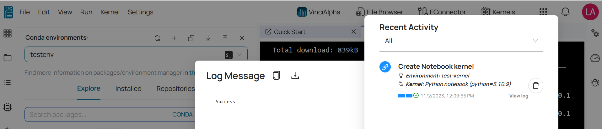

```R
# We can download the log.
```

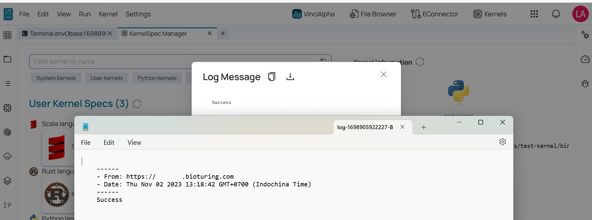

:high_brightness: **Kernel Manager**


```R
Kernel Manager is the place where all the kernel System + User kernel located.

User Kernel : List of the Kernels, which were created by user. Which can be used to run notebook.

System Kernel : BioStudio pre-define kernels. Which can be used to run notebook. 
```

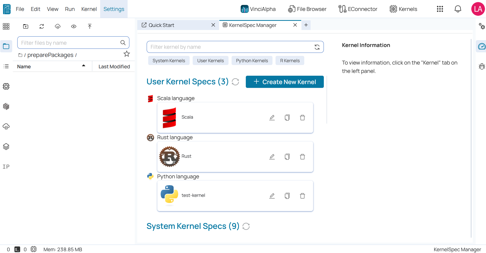

:two: From Env

```R
From Env can be used to create kernel using existing environment.

# provide name of kernel on name field.

# Select choose A Mode as From Env.

# Select existing Environment from the list.

# Select language.

```


```R
# Click on Create button.
```


```R
# We can see the progress on recent activity notification icon.
```

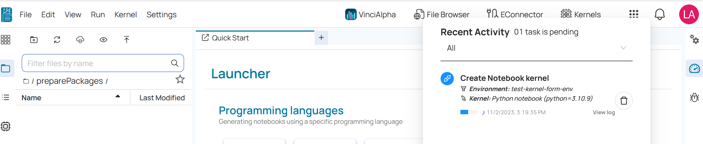

```R
Open kernel manager to list user define kernel.
```


```R
Created Kernels are listed here. That can be used to run notebook.
```


:three: **From file**

```R
BioStudio is providing great feature to create notebook kernel using environmental file.

# Provide name of Kernel

# Choose A Mode : From File

# Upload environmental file by clicking Browse button.

# Select Language.

# Select Version.
```


```R
# Click on Create button.
```

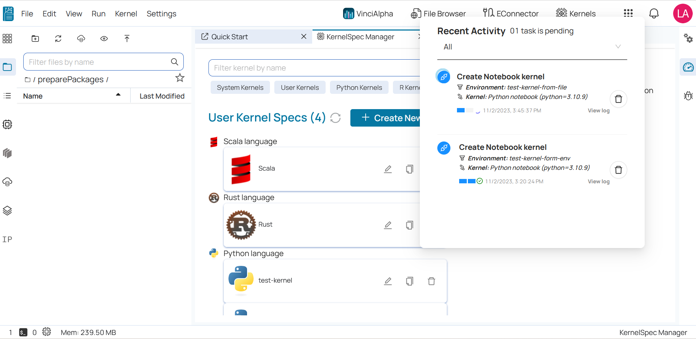

:four: **From BioTuring**

```R
This functionality can be used to create a kernel that was previously requested by client. That specific package would be available in this list. That can be selected to create kernel.

# Provide name of kernel.

# Choose A Mode From BioTuring.

# Select Your requested Environment.

# Select specific Language.

# Version would be selected automatically.

# Click on Create.
```


```R
You can see the progress on Recent Activity by clicking notification icon.
```


```R
All the Kernels are listed on Kernel manager.
```

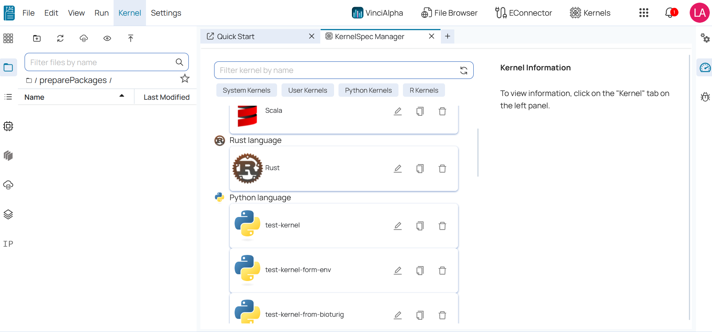

:arrow_forward: **Attach Kernel to the Notebook.**

```R
Click on File --> New --> Notebook.
```

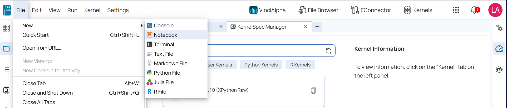

```R
Attached the kernel based on your requirement.
```

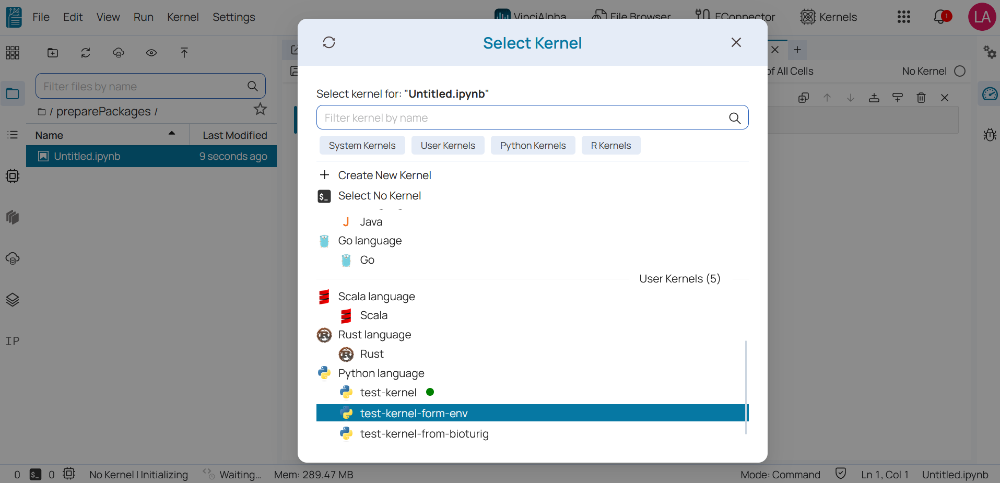

```R
You can switch the Kernel using switch kernel button.
```

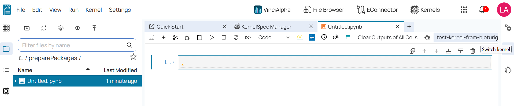